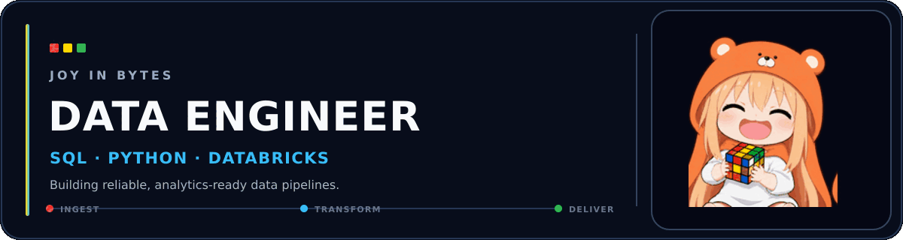

## Christine Joy Balansay
### Data Engineer | SQL · Python · Databricks

FTW Data Engineering Scholar with a background in Financial Management and risk operations. I build practical data workflows that move raw data toward reliable, analytics-ready datasets.

My current focus is pipeline development, data quality, dimensional modeling, and clear, maintainable documentation.

## What I work with

| Build | Transform | Model | Validate |
|---|---|---|---|
| ETL/ELT pipelines, batch ingestion | SQL, Python, Spark, Delta Lake | Medallion architecture, star schemas | Data quality checks, reconciliation, CI/CD |

## Contribution activity

Learning and building through data projects, SQL practice, and technical documentation.

---

### “Fueled by lifelong learning, grounded in purpose—one pipeline at a time.”

